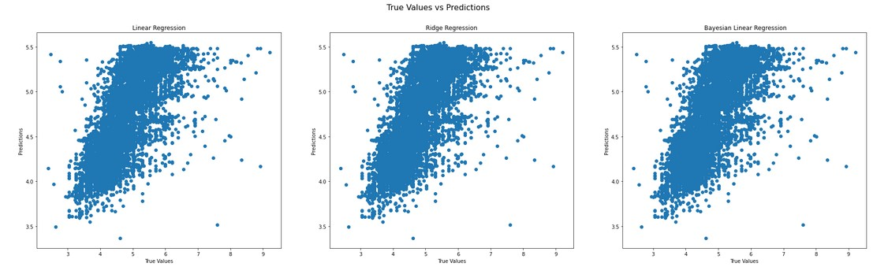
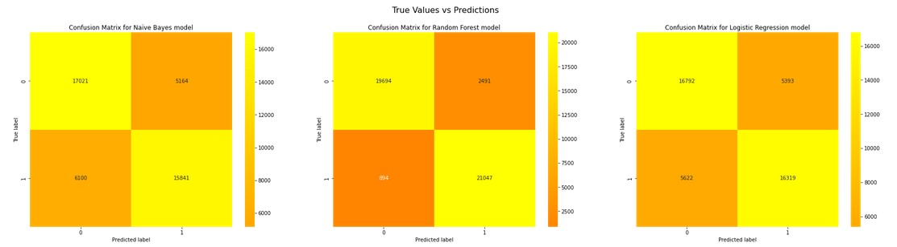
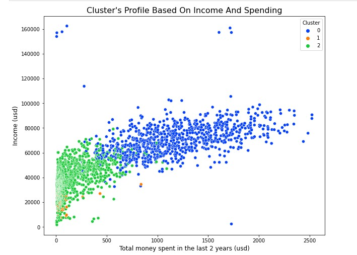

**Organisation: [mlpack](https://github.com/mlpack)**

**Project: [Example Zoo](https://summerofcode.withgoogle.com/programs/2022/projects/1hgAURBM)**

**Mentors: [Ryan Curtin](https://github.com/rcurtin) and [Kartik Dutt](https://github.com/kartikdutt18)**

## Abstract
This summer, I was selected for Google Summer of Code to work on project `Example Zoo` for mlpack organization. Mlpack is a fast, flexible C++ machine learning library aiming to provide fast, extensible implementations of cutting-edge machine learning algorithms. mlpack is open source software, which means it is a community-led effort. 
Over the course of the last years, various machine-learning algorithms have been implemented as a part of mlpack. This project focused on applying some of the algorithms to interesting datasets to see how they fare. This allowed us to show (off!) the potential usage of mlpack through various real-world domains.

## Goal
- The main objective of the project was to deliver two or three medium sized notebooks in Python. One of them should be a regression notebook while another one should be a classification notebook.
- We discovered along the way that the imputer function in mlpack had no Python binding. So, after finishing the first part of the project, we worked on adding Python binding support for the imputer function.

## Results

A total of 3 Python notebooks were added to the examples repository. In each one of them, I performed:
- Data preliminary wrangling
- Data cleaning
- Exploration of data
- Visualizations to better understand the data
- Applying the machine learning models
- Evaluating the models and making prediction

## Contributions 

Here is the list of PRs (both open & closed) that I created during GSoC.

| &nbsp;&nbsp;&nbsp;&nbsp;&nbsp;&nbsp;PULL &nbsp;&nbsp;REQUESTS                         | &nbsp;&nbsp;COMMITS                                                                                                                                                                                                                                                                                                                                                                                                                                                                                                                | &nbsp;&nbsp;&nbsp;&nbsp;&nbsp;&nbsp;&nbsp;&nbsp;&nbsp;&nbsp;&nbsp;&nbsp;&nbsp;&nbsp;&nbsp;&nbsp;&nbsp;&nbsp;&nbsp;&nbsp;&nbsp;&nbsp;&nbsp;&nbsp;&nbsp;&nbsp;&nbsp;&nbsp;&nbsp;&nbsp;&nbsp;&nbsp;&nbsp;&nbsp;&nbsp;&nbsp;&nbsp;&nbsp;&nbsp;&nbsp;&nbsp;&nbsp;DESCRIPTION                                                                                     | &nbsp;&nbsp;&nbsp;&nbsp;&nbsp;&nbsp;STATUS |
|:------------------------------------------------------------------------------------- |:---------------------------------------------------------------------------------------------------------------------------------------------------------------------------------------------------------------------------------------------------------------------------------------------------------------------------------------------------------------------------------------------------------------------------------------------------------------------------------------------------------------------------------- |:----------------------------------------------------------------------------------------------------------------------------------------------------------------------------------------------------------------------------------------------------------------------------------------------------------------------------------------------------------- |:------------------------------------------ |
| [#200](https://github.com/mlpack/examples/pull/200)                                   | <ul> <li> [c8059d9](c8059d93220c4d50d13822e1674eeea5eb105b06) </li> <li> [cb3300b](cb3300b5daee8288b7d0218fa7e11911e1a445e5) </li> <li> [10306d3](10306d357f96e1ae20b513ede7073f25bb6fd2ad) </li> <li> [e07e4cf](e07e4cf94a2cb1e2f7a9443d8799fd91dd62c2f0) </li> <li> [c83e12a](c83e12a7b058b29543833673bfc100d083aa8557) </li> <li> [c62c07c](c62c07cf7988cf88d9d16168308c2997411bb09f) </li> <li> [bfb0931](bfb0931bb6ad10e3e3aa9b53fe5e93ed715169bd) </li> <li> [c83a94b](c83a94b0fd2a37427b34517947775feca5ff3a63) </li> <li> [4397d71](4397d71eca10a9c5a4e22614d5057f29e4a788b1) </li> </ul>                                                                                                                                                                                              | **NYC Airbnb price prediction** - Performed descriptive and exploratory analysis of the data in order to understand how the phenomena of each variable behave individually a	d transversely.    - Used kernel density estimation (KDE) to estimate of the underlying distribution of the target variable.  - Applied One-Hot-Encoding to categorical variables.  - Used cross-validation to choose between several machine learning models (Linear regression - Ridge Regression - Bayesian Linear Regression) to accurately predict the price of the listing.                                                                    | :purple_square:Merged                      |
| [#202](https://github.com/mlpack/examples/pull/202)                                   | <ul> <li> [ea7e833](ea7e833bf67f0ffe967ad179a16628de2f3a1a38) </li> <li> [e265ccf](e265ccfc943ee3bb891522ced071fb59449b1450) </li> <li> [a6a1280](a6a1280eec745071e3b7ed8df9eaa7c29b0a5e5e) </li> <li> [497ed93](497ed932890d3c3a5b83129a54b3f7b4a8092408) </li> <li> [f546a63](f546a632f007d6bec567c04e6680168df5f5bfcf) </li> <li> [05a74a9](05a74a93e874b7090cbea444ed4d8a050281ab3e) </li> <li> [dd7de1e](dd7de1e5f142d45ba108b32b835bfafc366e13d8) </li> <li> [9945371](9945371c1f6f0318ece354bffafe875e847be4d5) </li> <li> [5213253](52132531c6c691c38e4cfb5715402e7dee14e48d) </li> <li> [8520c49](8520c49d2381fc557ab8e642a06374ae99994fcd) </li> <li> [2811236](28112361e002cc2dd17f4911fa846f6692a2e1ab) </li> </ul>                                                                                                                                                                                              | **Rain in Australia prediction** - Applied exploratory data analysis techniques to the data to better understand the underlying patterns.  - Applied feature engineering which included encoding date as it is a cyclic feature and handling class imbalance for classification.  - Used feature scaling and PCA for dimensionality reduction.  - Implemented 3 classification models (Naïve Bayes - Random Forest - Logistic Regression) to predict whether it rains the next day or not. </li> </ul>                                                                                                                                                                                                                       | :purple_square:Merged                      |
| [#205](https://github.com/mlpack/examples/pull/205)                                   | <ul> <li> [1b44d08](1b44d08c6e71d4a1f3d95fbab10447faf41bbb3a) </li> <li> [924c779](924c779b50a4b8071a140a9614d4f1357cad1e94) </li> <li> [5678e7c](5678e7c3e86f3e56b35048ae553ed17e7e0c77d3) </li> </ul>                                                                                                                                                                                                                                                                                                                                                                                                                                                          | **Customer Personality Analysis** is a detailed analysis of a company’s ideal customers. It helps a business to better understand its customers.  The notebook includes: - Exploratory data analysis.  - Feature engineering. - Performing an unsupervised clustering of data using Kmeans to optimize the significance of each customer to the business.                                                                                                                                                                                                                                                             | :purple_square:Merged                      |
| [#3260](https://github.com/mlpack/mlpack/pull/3260)                                   | <ul> <li> [0f24795](0f247951b55dde751d1b249776d62ae99f8e910a) </li> <li> [ee3a35f](ee3a35f636417c4d116395e635d7dc5a6e2707e2) </li> <li> [feb3aa3](feb3aa357b7f43dd750e9e8d78beae9498e268f8) </li> <li> [ca7af64](ca7af6491ba2008a3f13f1eb01ef9abdd541b1ee) </li> <li> [1b2c566](1b2c566f3a44e2fa738d1aa3bc8c6c60e1d8d907) </li> <li> [0f5fea3](0f5fea3b3e545ad719bba19e65f7aae69fc1ee41) </li> <li> [4c62a14](4c62a14d2b65d328ec99317c74d13c0e7216d5fa) </li> <li> [6f03634](6f0363424abe2abcf0813208350570b1bc97f58f) </li> <li> [c82a480](c82a480dbb634eac736921d7d870f1c63fb90e92) </li> <li> [1a81231](1a81231f5b89218d85450ecb9bca67ce35a33dc0) </li> <li> [07329c0](07329c02282614553d2e31530975ecae4500c73d) </li> <li> [337a09f](337a09f75934887c0a96777386960e38cf4b2018) </li> <li> [6591193](65911932f3857b5bea46194e6d700727e5a66f3d) </li> <li> [a149cfe](a149cfed335a68e37dbef27a69087b2a6596756d) </li> <li> [03046ea](03046eae3dfcbc2599aa293fbfb564a61e60e08a) </li> <li> [f705646](f7056464c425ea5c5641ae76b1cba4a046abc8d0) </li> <li> [57c3fb0](57c3fb0d0182cbe65d45c85be50bc56923da1448) </li> <li> [f60e725](f60e72519386dfa1c48e4697fdf872fa48091be2) </li> <li> [e64f07e](e64f07e2653d356773765de92396a93d886a8eb6) </li> <li> [edfad6c](edfad6c79c6802d6a63b8bd65eaf22254d017a87) </li> <li> [c93616e](c93616e99e8f8919a16442016e31a9b4a299eab5) </li> <li> [4d375d2](4d375d2a3dc50417d94748980594636a407afe09) </li> <li> [fbcbf62](fbcbf62e03fd14815f848d3432a30e6ace159603) </li> <li> [25e7b6f](25e7b6f2a1c35d1f2e94bc6b05679dd0ff6435bc) </li> <li> [15eaf59](15eaf593ad25ea95641c7a4dc69dfdf26d3de81b) </li>  </ul>                                                                                                                                                                                              | In this PR, We are working on adding Python binding support for the imputer function                                                                                                                                                                                          | :green_square:Open                      |
## Evaluation metrics
1. NYC Airbnb price prediction

Mean Absoulte Error: 0.37  
Mean Squared Error: 0.26  
Root Mean Squared Error: 0.51    
R2 score: 0.46  

2. Rain in Australia prediction

Accuracy: 0.92  
Cohen's Kappa: 0.85  
Recall Score: 0.92  
Precision Score: 0.92    

3. Customer personality clustering   

## Future plans 
The last three months of my life were unforgettable. This time was very precious to me. After GSoC, I would like to continue the same spirit of the contribution that I maintained during GSoC. I would like to get involved more in the community. I will also like to work on some new or existing projects from my organization. In the end, I will try my best to be more and more helpful to the community.

## Acknowledgement 
On this ending note, I want to thank my mentors Ryan Curtin and Kartik Dutt for constantly supporting me from the very beginning of my contributions. I am very thankful for their patient behavior whenever I got stuck and their suggestions that helped me in resolving them. Also, I am thankful to the whole mlpack family who provided me this wonderful opportunity of working on such an amazing project.

## Ways to reach me

  
  

